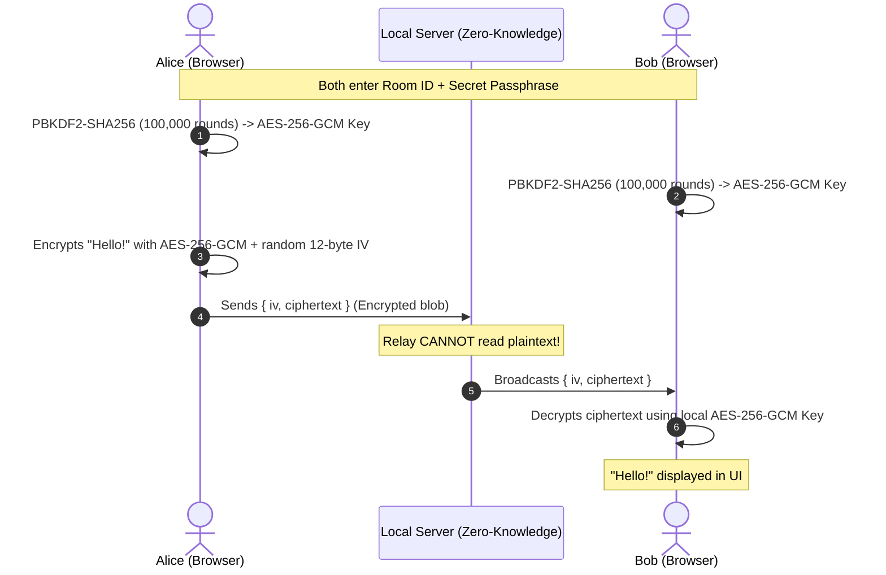

# 👻 Ghost Chat

> **Zero-Knowledge, End-to-End Encrypted, Ephemeral LAN Chat Server**  
> Private, self-hosted, browser-based messaging with zero cloud dependencies and zero logs.

[](LICENSE)
[](https://nodejs.org/)
[](#security--cryptography)
[](#zero-knowledge-architecture)

---

## ⚡ Highlights

- **🔒 True End-to-End Encryption (E2EE):** Everything (text, images, files) is encrypted directly in your browser using the native **Web Crypto API (AES-256-GCM)** before leaving your device.
- **🛡️ Zero-Knowledge Relay:** The server acts as a dumb relay. It only sees encrypted ciphertext blobs and IVs. Even with Wireshark or server memory inspection, messages cannot be decrypted.
- **🗝️ Client-Side Key Derivation:** Room passphrases are never sent over the network. Keys are derived locally using **PBKDF2-SHA256 (100,000 iterations)** with room-specific salts.
- **📱 Instant LAN Access & QR Code:** Host it on your laptop or home server and scan the QR code from your phone or tablet on the same Wi-Fi.
- **📎 Encrypted Media & File Drops:** Share encrypted screenshots, photos, and files up to 25MB with client-side decryption.
- **🔥 Burn-After-Reading (TTL):** Set messages to automatically self-destruct after 10s, 30s, 1m, 5m, or 1 hour.
- **🚨 Emergency Panic Button (`Esc` × 2):** Immediately purges all keys from RAM, clears chat history, and switches to a disguise screen.
- **✨ Synthesized Web Audio:** Modern, subtle sound effects synthesized directly with the Web Audio API—no external MP3 downloads.

---

## 🔐 Security & Cryptography



### Safety Emoji Fingerprints
Ghost Chat computes a unique **Safety Fingerprint** (Emoji sequence + Hex ID) from the derived encryption key. Participants can visually verify that their emoji sequence matches to guarantee zero Man-in-the-Middle (MITM) attacks.

---

## 🚀 Quickstart

### Prerequisites
- [Node.js](https://nodejs.org/) (v18 or higher)
- npm or bun

### 1. Install Dependencies
```bash
npm install
```

### 2. Run in Development Mode
```bash
# Runs frontend on :5173 and WebSocket/Express backend on :3000
npm run dev
```

### 3. Production Build & Start
```bash
# Build optimized frontend assets
npm run build

# Start the unified local server
npm run start
```

Open your browser to:
- **Local:** `http://localhost:3000`
- **LAN (other devices on Wi-Fi):** `http://<your-local-ip>:3000`

---

## ⌨️ Shortcuts & Hotkeys

| Hotkey | Action |
|---|---|
| `Enter` | Send encrypted message |
| `Shift` + `Enter` | Insert new line |
| `Esc` × 2 | **Panic Mode** (Wipe RAM, purge keys, and camouflage screen) |

---

## 📁 Project Structure

```
Ghost Chat/
├── server/
│   ├── index.js          # Express + WebSocket zero-knowledge relay
│   └── utils/
│       └── network.js    # Local network IPv4 auto-detection
├── src/
│   ├── crypto/
│   │   └── e2ee.js       # Web Crypto API AES-GCM + PBKDF2 engine
│   ├── hooks/
│   │   ├── useWebSocket.js # Resilient WebSocket client hook
│   │   └── useAudio.js   # Synthesized sound effects
│   ├── components/
│   │   ├── Lobby.jsx     # Room creation & key derivation
│   │   ├── ChatRoom.jsx  # Main encrypted chat interface
│   │   ├── MessageBubble.jsx # Decrypted message bubble & burn timer
│   │   ├── MessageInput.jsx  # Rich input, attachments & TTL
│   │   ├── QRCodeModal.jsx   # LAN invite QR generator
│   │   ├── RoomInfoModal.jsx # Security fingerprint verification
│   │   └── PanicOverlay.jsx  # Camouflage screen wipe
│   ├── App.jsx           # Application controller
│   ├── main.jsx          # React entry
│   └── index.css         # Tailwind styles & ghost stealth theme
├── package.json
└── vite.config.js
```

---

## 📄 License
MIT License © [Ansh](https://github.com/anshk1234)
