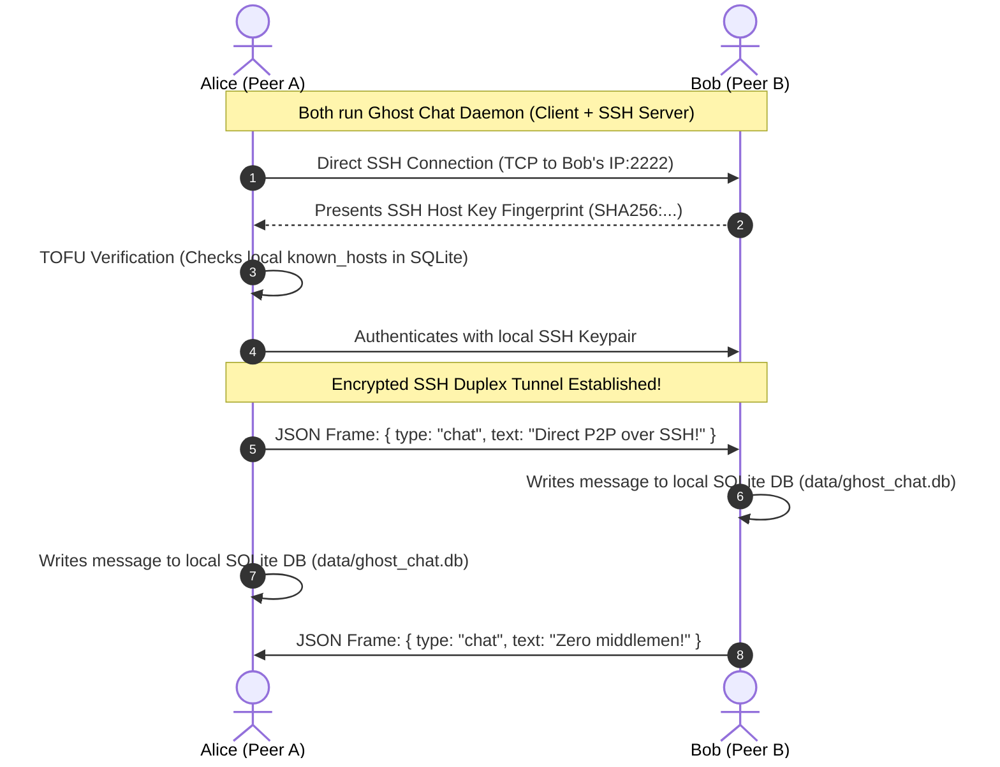

# 👻 Ghost Chat (P2P SSH Edition)

> **Decentralized, Direct Peer-to-Peer Encrypted Terminal Messenger Powered by SSH**  
> Direct device-to-device communication with zero middlemen, zero tech giants, and 100% local-first data privacy.

[](LICENSE)
[](#how-it-works)
[](#data-privacy)
[](#motivation)
[](#-contributors)

---

## 🎯 The Motivation
Many end-to-end encrypted chat applications still rely on centralized relay infrastructure owned by tech giants. Even with client-side encryption, central servers can log metadata (who talks to whom, when, and how often), create single points of failure, or be subjected to censorship and surveillance.

**Ghost Chat P2P removes that middleman entirely.**
- Devices communicate **directly with one another over SSH**.
- By entering a recipient's IP address and port, users establish a direct, encrypted TCP tunnel.
- No central server. No relay. No telemetry.

---

## ⚡ How It Works



1. **Dual-Role Architecture:** Every node simultaneously acts as an **SSH Server** (listening for incoming connections on port `2222` or custom) and an **SSH Client** (dialing recipient IP addresses).
2. **Standard SSH-2 Transport Encryption:** All traffic is encrypted using authenticated SSH-2 transport ciphers (ChaCha20-Poly1305, AES-GCM) with ephemeral Diffie-Hellman key exchange providing Perfect Forward Secrecy (PFS).
3. **Keypair & Host Key Verification:** Generates an SSH keypair on first run. Employs **TOFU (Trust On First Use)** and records host fingerprints in a local `known_hosts` table to detect and prevent MITM attacks.
4. **LAN Peer Auto-Discovery:** Background UDP broadcast beacon (`44555`) automatically discovers other Ghost Chat peers running on the same local Wi-Fi / subnet.
5. **Connection & NAT Keep-Alive:** Periodic ping/pong packets keep firewall NAT state tables active during idle periods.
6. **Data Privacy (Local SQLite):** Chat history, saved contacts, and known host keys are stored **exclusively in a local SQLite database** (`data/ghost_chat.db`) on your machine. Zero cloud storage.

---

## 🔒 Security & Cryptographic Guarantees

| Security Property | Implementation Mechanism |
|---|---|
| **Confidentiality & Integrity** | SSH-2 Transport Layer Protocol (RFC 4253) using authenticated ciphers (`chacha20-poly1305@openssh.com`, `aes256-gcm@openssh.com`). |
| **Authentication** | Cryptographic SSH keypairs (`RSA-2048` / `Ed25519`) generated locally with strict file permissions (`0600`). |
| **MITM Protection** | SHA-256 host key fingerprint calculation with Trust On First Use (TOFU) persisted in SQLite. |
| **Forward Secrecy** | Ephemeral Diffie-Hellman / ECDH key exchange per SSH session guarantees past conversations cannot be decrypted even if long-term keys are compromised. |
| **Zero Metadata Leakage** | Direct IP-to-IP socket. No third-party servers observe communication patterns, timestamps, or routing graphs. |

---

## 🖥️ Terminal UI (TUI) Preview

```
┌─ 👻 GHOST CHAT | Direct P2P SSH | Alias: Alice | Listen: 192.168.1.15:2222 ──────────────────┐
│                                                                                              │
├─ Peers & LAN (Tab) ──────────────┬─ Chatting with: Bob (192.168.1.45:2222) [SSH Encrypted] ─┤
│                                  │                                                           │
│ 🟢 Bob (192.168.1.45:2222)       │ [10:42 AM] <Bob> Hey Alice! No middleman server here.     │
│ 📡 Charlie (192.168.1.80:2222)   │ [10:43 AM] <You> Connected directly over SSH tunnel!      │
│                                  │                                                           │
├──────────────────────────────────┴───────────────────────────────────────────────────────────┤
│ [Message / Command]> Hello Bob!                                                              │
├──────────────────────────────────────────────────────────────────────────────────────────────┤
│ [Enter] Send | /connect <ip:port> | /peers | /help | [Tab] Switch Focus | [Ctrl+C] Exit      │
└──────────────────────────────────────────────────────────────────────────────────────────────┘
```

---

## 🚀 Quickstart

### Prerequisites
- [Node.js](https://nodejs.org/) (v18 or higher)

### 1. Install Dependencies
```bash
npm install
```

### 2. Launch Ghost Chat Terminal UI
```bash
# Start with default settings (port 2222, auto-generated alias)
npm run chat

# Or specify a custom port and alias
node bin/ghost-chat.js --port 2222 --alias Alice
```

---

## 🧪 Testing Multi-Node Locally

To test direct P2P communication on a single computer, open two separate terminal windows:

**Terminal 1 (Alice):**
```bash
node bin/ghost-chat.js --port 2222 --alias Alice
```

**Terminal 2 (Bob):**
```bash
node bin/ghost-chat.js --port 2223 --alias Bob
```

In Alice's terminal, connect directly to Bob:
```
/connect 127.0.0.1:2223
```
Now type and hit `[Enter]`. Both nodes will chat directly over the encrypted SSH tunnel and store history in their local SQLite database!

---

## ⌨️ TUI Commands & Hotkeys

| Command | Action |
|---|---|
| `/connect <ip[:port]>` | Dial a recipient's IP address directly via SSH |
| `/peers` | List active SSH connections and discovered LAN peers |
| `/clear` | Clear the current message log |
| `/help` | Display command help |
| `/quit` | Shut down and exit |
| `[Tab]` | Switch focus between the peer sidebar and the message input bar |
| `[Ctrl+C]` | Exit Ghost Chat |

---

## 📁 Technical Architecture

```
Ghost Chat/
├── bin/
│   └── ghost-chat.js          # CLI executable runner
├── p2p/
│   ├── core/
│   │   └── engine.js          # Central P2P orchestrator
│   ├── ssh/
│   │   ├── keys.js            # SSH Keypair generator & SHA256 fingerprints
│   │   ├── server.js          # Embedded direct SSH Server
│   │   ├── client.js          # Direct SSH Client with host verification
│   │   └── protocol.js        # Newline-delimited JSON stream framing
│   ├── storage/
│   │   └── database.js        # Local SQLite storage (messages, contacts, known_hosts)
│   ├── network/
│   │   ├── discovery.js       # UDP LAN broadcast peer discovery
│   │   └── interfaces.js      # Local network IP detection
│   └── tui/
│       └── app.js             # Blessed interactive terminal UI
├── data/                      # Local SQLite DB & SSH keys (strictly .gitignored)
└── package.json
```

---

## 👥 Contributors

- **[Ansh](https://github.com/anshk1234)** — Project Creator & Lead Architect
- **[Antigravity](https://github.com/google-deepmind)** — AI Pair Programmer & P2P SSH Architect

---

## 📄 License
MIT License © [Ansh](https://github.com/anshk1234)
